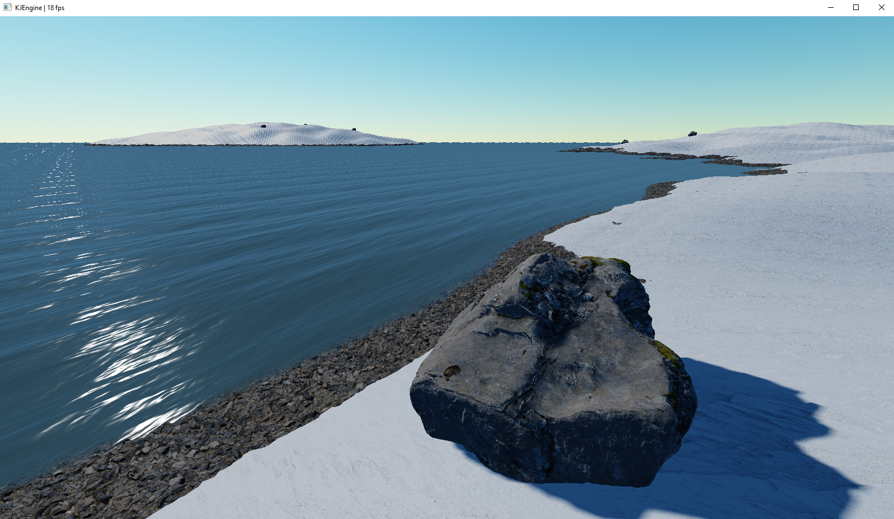

# KJEngine
Rendering framework / game engine for Java

Tesselated 256x256 FFT water, tesselated PBR terrain (custom terrain renderer), PBR models, 2 shadow maps (4K) and atmospheric scattering run on a NVIDIA GEFORCE 940MX Laptop GPU.

## Getting started

All you need to start using KJEngine is [Eclipse](https://www.eclipse.org/downloads/) 2019 (or newer) and Java 12 (or newer). Copy the modules into your current workspace folder and create Java projects with the names of the module folders to start using them. To include KJEngine into your project, add `requires de.kjEngine.core;` to your module. The core module exports large parts of the API using `requires transitive`.

Note: KJEngine needs a package to be `open` in order to read files it may contain.

## Modules

- `de.kjEngine.core` The core module that should always be used when developing an application.
- `de.kjEngine.audio` A wrapper for OpenAL that can be extended to use different APIs (don't use).
- `de.kjEngine.graphics` A wrapper for Vulkan that can be extended to use different APIs.
- `de.kjEngine.component` A component system (ECS without entities) used by the scene and ui APIs.
- `de.kjEngine.io` Basic io utils.
- `de.kjEngine.math` A small math library for linear algebra, geometry and RNG.
- `de.kjEngine.renderer` The basis of the KJEngine renderer (rendering pipelines and some basic filters)
- `de.kjEngine.scene` The scene graph.
- `de.kjEngine.scene.physics` This may be a 3D physics engine some day (don't use).
- `de.kjEngine.scene.renderer` A renderer for the scene graph that supports things like terrain, water and model rendering.
- `de.kjEngine.thirdparty` Every third party library goes here.
- `de.kjEngine.ui` A small GUI library designed with real-time rendering in mind.
- `de.kjEngine.util` Everything that doesn't fit into the other modules and a container API  that aims to fill in some lacks of the `java.util` collection API (mainly getting a immutable view of a container without allocating a wrapper object that throws exceptions when you try to access methods that would mutate the container).
- `de.kjEngine.editor` This may become a real scene editor some day.
- `de.kjEngine.demos` Small demonstrations of some features of the engine (Most of them are currently broken because of API changes and laziness).